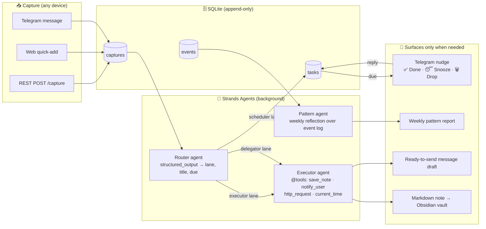

# Offload

**Type it. Forget it. The agent has it now.**

Offload is an executive-function agent for people with ADHD, built with the
[Strands Agents SDK](https://strandsagents.com). You throw half-formed thoughts at it
from any device — Telegram, a web page, anything that can POST — and it decides what
should happen to each one, does what it can by itself, and only pings you when there is
a real decision or a real deadline. No app to organize, no inbox to groom, no system to
maintain — maintaining the system *is* the ADHD tax this removes.

Built for the AWS **Agents for Humans** hackathon · *Everyday Agents* track.

## The problem

ADHD working memory is a leaky bucket. Every "I should..." thought either interrupts what
you're doing or evaporates. Conventional task apps fail because they demand the exact
executive functions that are impaired: categorizing, scheduling, prioritizing, remembering
to open the app. The result is floating dread — dozens of half-remembered obligations with
no landing place.

Offload inverts the contract: **capture must cost nothing** (one message, under 100 ms,
no decisions asked), and **all organizing intelligence runs in the background**.

## How it works



Every capture is routed by the **Router agent** into one of three lanes:

| Lane | Meaning | What happens |
|------|---------|--------------|
| `executor` | The agent can do it itself | Executor agent runs its tools now: polishes notes into the vault, looks things up, summarizes — then tells you it's handled |
| `delegator` | Another human is needed | Executor agent writes a ready-to-send draft (right tone, no placeholders) and hands it to you for approval |
| `scheduler` | Only you can do it, at a time | A nudge fires on your phone at the right moment, with one-tap Done / Snooze / Drop |

A **Pattern agent** reads the append-only event log weekly and writes a short,
non-judgmental reflection: nudge-to-done latency, abandon rates, which capture sources
you actually use — data, not guilt.

## Strands Agents usage

- `Agent` + `structured_output_async(RoutingDecision, ...)` — schema-validated lane
  classification, no JSON parsing ([offload/agents/router.py](offload/agents/router.py))
- `@tool` custom tools `save_note` / `notify_user` mixed with prebuilt
  `strands_tools.http_request` / `current_time` ([offload/agents/executor.py](offload/agents/executor.py))
- Model-provider switching: **Amazon Bedrock** (default) or Anthropic API via one env var
  ([offload/agents/model_factory.py](offload/agents/model_factory.py))
- Deterministic outer loop (APScheduler), agents invoked only at decision points — the
  agent runs quietly in the background rather than living in a chat window

## Quickstart

Requires Python 3.13+ and [uv](https://docs.astral.sh/uv/).

```bash
git clone https://github.com/ihddirmas/offload-agent && cd offload-agent
uv sync
cp .env.example .env        # then edit — see below
uv run uvicorn offload.api:app --port 8000
```

Open http://localhost:8000 — type a thought, watch it get routed within ~15 s.

### Model provider

| Provider | Setup |
|----------|-------|
| Bedrock (default) | AWS credentials in your environment (`aws configure`), model access enabled for Claude in the console |
| Anthropic API | `MODEL_PROVIDER=anthropic` and `ANTHROPIC_API_KEY=...` in `.env` |

### Telegram (optional, recommended — this is the cross-device magic)

1. Create a bot with [@BotFather](https://t.me/BotFather), put the token in `TELEGRAM_BOT_TOKEN`
2. Message your bot once, get your chat id (`https://api.telegram.org/bot<TOKEN>/getUpdates`), set `TELEGRAM_CHAT_ID`
3. Point the webhook at your server: `https://api.telegram.org/bot<TOKEN>/setWebhook?url=<public-url>/telegram/webhook`
   (for local demos: `ngrok http 8000`)

Now any text you send the bot from any device becomes a capture, and nudges arrive
as Telegram messages with Done / Snooze / Drop buttons. Without a token, nudges fall
back to the console so everything still runs.

### Obsidian / notes vault

`NOTES_DIR=path/to/your/vault/Inbox` — executor-lane notes land there as markdown
with frontmatter. Defaults to `./notes-out`.

## Tests

```bash
uv run pytest
```

The agent boundary is injectable everywhere (`decide=`, `run=`), so the full
capture → route → nudge → reply loop is tested without model calls.

## Disclosure

The staged design document for this concept (`adhd-offload-build-prompts.md`, a personal
planning doc predating the hackathon) informed the architecture. All code in this
repository was newly written with the Strands Agents SDK during the submission period.

## License

[MIT](LICENSE)
